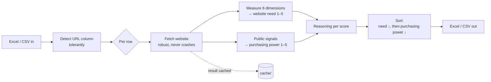

# Lead-Analyzer

**Turn a raw customer list into a ranked call sheet — best sales opportunities on top — in a single run.**

Sales regularly receives spreadsheets with hundreds of companies and the same recurring question:
*Who do I call first?* That question has two halves — **Who needs a better website (technically)?**
and **Who can afford it (financially)?** — and answering both by hand for every row takes days and
ends up as gut feeling.

Lead-Analyzer answers both halves automatically for the **entire list**, assigns two transparent
1–5 scores per customer, and sorts the ideal leads to the top. An Excel file goes in, the same
Excel file comes out — just with two new columns and the right order.

> The project's internal artifacts (`docs/`, code comments, the reasoning column) are in German,
> since the tool was built for the Swiss/DACH market. This README is in English for a broader audience.

---

## The problem it solves

Prioritizing a customer list is really two pieces of research per row:

- **Does this company need a better website (technically)?** You'd have to open the site, check
  whether it even loads, whether it works on mobile, whether Google can find it, whether it's
  secure (HTTPS), whether there's a contact form and a legal notice … several minutes per customer.
- **Can this company afford it (financially)?** You'd have to dig up legal form, industry, and size
  to estimate purchasing power.

At 300 companies that's nobody's job — so it doesn't get done, and Sales works the list top to
bottom instead of *good* to *bad*. That's exactly the gap this tool closes: it runs both pieces of
research for every row, **consistently and without fatigue.**

---

## What you get out

The same table as before — all original columns untouched — plus **two score columns** and a
**reasoning** column:

| Customer | Website | Website-Bedarf (1-5) | Zahlungskräftigkeit (1-5) | Reasoning |
|---|---|:--:|:--:|---|
| Beispiel AG | beispiel.ch | **5** | **5** | no reachable website · AG, high-spend industry |
| Muster GmbH | muster.ch | **3** | **3** | solid site, no HTTPS · GmbH, mid-tier industry |
| Klein-Atelier | — | **5** | **1** | no website on file · sole proprietorship |

Both scores are **whole numbers from 1 to 5** — so they're sortable and filterable. (The column
headers stay in German because they're written into the customer's own spreadsheet: *Website-Bedarf*
= website need, *Zahlungskräftigkeit* = purchasing power.) The output is already sorted:
**descending by need first, then by purchasing power.** That puts companies that *need* a new
website **and** can *afford* it right at the top — the ideal leads. For every score, the
**reasoning column** shows which signals drove it: no score is a black box.

### A second sheet with ready-made sales arguments

The output workbook also contains a second worksheet, **"Verkaufsargumente"** — one row per
company that flips the analysis from *deficit* to *gain*. Where the main sheet says *what's
missing*, this sheet says *what a modern website solution would deliver and what it concretely
brings*: per company its measured deficits, the matching capability (own domain + SSL,
responsive design, SEO, AI/answer-engine readiness, contact features), and the concrete benefit
("found on Google", "reaches mobile visitors", "no *not secure* warning"). It's a deterministic
mapping from the same six dimensions — no guesswork, and a company with a modern site honestly
gets a *"keine akuten Defizite"* note instead of invented weaknesses. Sales can read talking
points straight off the row.

---

## What the tool does *not* do (and why that's good)

It **does not invent facts**. Purchasing power is an **explicitly labeled estimate** from public
signals (legal form from the company name, industry, size hints on the website) — not audited
financials. Where the data is thin, the tool estimates **conservatively** and says so. A score you
can't trust is worthless to Sales; that's why every grade traces back to concrete signals rather
than a language model that merely sounds plausible.

---

## How a run works



Every row runs inside its own error boundary: a broken URL, a timeout, or a parked domain
**never crashes the whole run** — the row gets a sensible score (no reachable website = high need)
plus a note, and processing continues.

---

## How the two scores are built

### Website need (1–5) — higher = greater need = better lead

Not a gut call, but derived from **six measurable dimensions**, each mapping to a promise a modern
website makes:

1. **Existence & substance** — does the site even load? Parked? Just a social-media profile?
2. **Technical basis** — HTTPS/valid SSL, own domain instead of a free subdomain.
3. **Mobile & performance** — responsive? (optional real Core Web Vitals via Google PageSpeed Insights, which runs Lighthouse).
4. **Findability (SEO)** — title/meta description, canonical, robots/sitemap, indexability.
5. **AI / answer-engine readiness** — structured markup (Schema.org/JSON-LD), Open Graph.
6. **Content, freshness & conversion** — contact form, `tel:`/`mailto:`, legal notice, freshness.

**No reachable website → automatic score 5** (overrides everything — whoever has no website needs
one most urgently). The full rubric with every measurement signal is in
[`docs/scoring_website_bedarf.md`](docs/scoring_website_bedarf.md).

### Purchasing power (1–5) — higher = more spending power = more worthwhile sale

Primarily from the **commercial register (Zefix)** — the switch is purely credential-driven, no
code change. Until that access is live, it falls back, by the same graceful-degradation principle
as PageSpeed, to a documented estimate from three public signals:

- **Legal form** from the company name (AG / GmbH / sole proprietorship).
- **Industry spending power** (which industry, how strong typically).
- **Size signals** on the website (multiple locations, team/careers page).

---

## Engineering notes

*For anyone looking under the hood — everyone else can skip this section.*

- **Pure Python CLI, no cloud, no frontend.** One file in, one file out. Runs fully **offline and
  without any API key** (graceful degradation: a PageSpeed key *improves* dimension 3 but is never
  required).
- **Parse-once architecture.** Each page's HTML is parsed exactly once; the same `soup` is handed
  to all HTML dimensions — no redundant re-parsing per dimension.
- **Robust by design.** Every row runs in its own exception boundary; network fetches never throw
  upward. A faulty row degrades to a sensible score instead of killing the run.
- **Repeatable & resumable.** Results are **cached on disk per URL**. An aborted run loses nothing
  — the next run skips already-analyzed URLs.
- **Parallelized with throttle.** Fetches run over a `ThreadPoolExecutor` (`--workers`, default 8);
  external APIs use retry/backoff against rate limits.
- **Transparency over elegance.** Scores come from deterministic, documented heuristics (no LLM
  judgment in the scoring path) — every score is traceable to its signals.
- **205 tests**, all green — including edge cases (empty URL, broken URL, parked domain).

---

## Try it yourself

```bash
python -m venv .venv
source .venv/bin/activate            # Windows: .venv\Scripts\activate
pip install -r requirements.txt

python run.py data/sample_input.xlsx -o output/leads.xlsx
```

That's it — setup in under 5 minutes, **no API keys needed.** The example run over
`data/sample_input.xlsx` scores 42 companies in ~3.7 s fully offline. Distribution in the sample:

- **Website need:** `1: 3 · 2: 12 · 3: 15 · 4: 10 · 5: 2`
- **Purchasing power:** `1: 3 · 2: 9 · 3: 10 · 4: 7 · 5: 13`

Why these example scores are plausible is explained in
[`docs/sample_run_rationale.md`](docs/sample_run_rationale.md).

### Common flags

| Flag | Meaning |
|------|---------|
| `input` (positional) | Input file (`.xlsx` or `.csv`) with a URL column |
| `-o`, `--output` | Output file (default: `output/leads_scored.xlsx`) |
| `-n`, `--limit N` | Process only the first N rows (small demo run) |
| `--csv` | Also write CSV |
| `--no-reason` | Omit the reasoning column |
| `--workers N` | Parallel fetch threads (default 8) |
| `--no-cache` | Bypass the cache entirely |
| `--no-pagespeed` | Turn off PageSpeed enrichment of dim 3 |

### Optional API keys (`.env`)

Everything runs without keys, but two optional credentials make two dimensions stronger.
Copy the template first (`cp .env.example .env`) and fill in what you have:

- **`PAGESPEED_API_KEY`** (free, from Google) → **dimension 3** measures real Core Web Vitals
  (LCP/CLS/TBT) via Lighthouse. *Without it, dimension 3 uses a lighter heuristic — it only
  checks the mobile viewport tag, not actual performance — so for a strict "all of dimensions
  1–4 really measured" run, this key is recommended.*
- **`ZEFIX_USER` + `ZEFIX_PASSWORD`** (both required; request access at `zefix@bj.admin.ch`) →
  **purchasing power** is grounded in the Swiss commercial register (authoritative legal form +
  status). Without them it falls back to the documented name/industry heuristic.

`.env`, `output/`, and `cache/` are gitignored and never committed — **put secrets only in `.env`,
never in the committed `.env.example`** — the tool works locally, no company data is published.

### Tests

```bash
python -m pytest tests/ -q
```

---

## Repository layout

```
lead_analyzer/
  pipeline.py        Orchestrator: read → score → sort → write
  analyzers/         the six need dimensions + purchasing-power estimate
  clients/           external APIs (PageSpeed) with retry/backoff
  scoring.py         aggregates dimensions into 1–5
  reasons.py         builds the reasoning column
  cache.py           per-URL on-disk cache
  table_io.py        Excel/CSV in & out
docs/                scoring rubric + sample-run rationale
tests/               205 tests
data/                sample_input.xlsx
```
